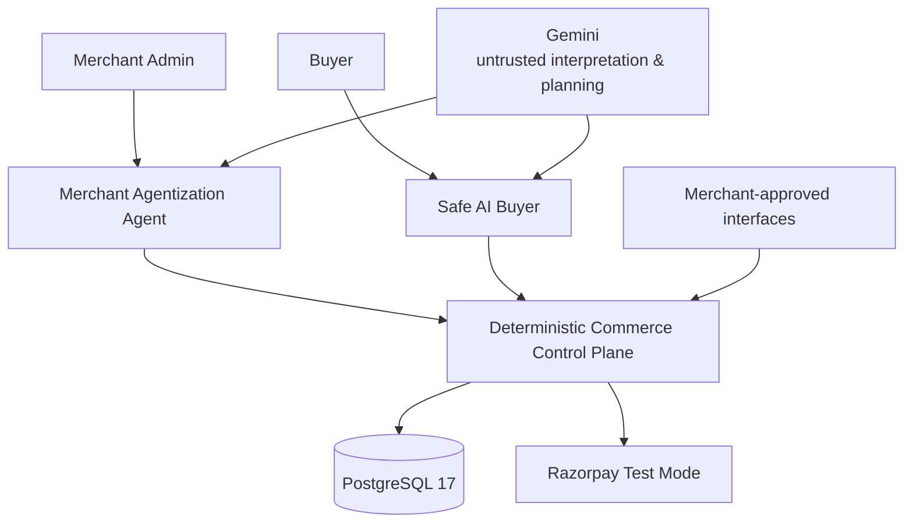

<p align="center">
  
</p>

<h1 align="center">Amana</h1>

<p align="center">
  <strong>Agentic commerce you can trust.</strong>
</p>

<p align="center">
  AI understands intent. Deterministic software controls truth, authority, and money.
</p>

---

## What is Amana?

**Amana is a deterministic trust layer for agentic commerce.**

It solves both sides of agentic commerce:

- **Merchant Agentization Agent** turns existing merchant-approved APIs, catalogues, and policies into tested, evidence-backed capabilities that AI buyers can safely use.
- **Safe AI Buyer** understands multimodal shopping intent and can discover, reason, and purchase without giving the model authority over money.

The core rule is simple:

> **AI may interpret, recommend, diagnose, and plan. It cannot decide what is financially true or independently execute what was not authorized.**

```text
Merchant-approved systems
        ↓
Merchant Agentization Agent
        ↓
Tested + evidence-backed capabilities
        ↓
────────────────────────────────────
        ↓
Safe AI Buyer
        ↓
Grounded merchant + product evidence
        ↓
Immutable Transaction Proposal
        ↓
Exact user authorization
        ↓
Deterministic Execution Gate
        ↓
Razorpay Test Mode
        ↓
Verified payment evidence
        ↓
Merchant fulfilment
```

**There is no AI → Razorpay authority path.**

---

## 60-second proof

Amana is not only a shopping demo. Its authority boundaries are independently exercised and measured.

| Proof | Result |
|---|---:|
| Deterministic safety cases | **250 / 250 passed** |
| Hard safety violations | **0** |
| Guard-removal negative controls | **12 / 12 killed** |
| Concurrency scenarios | **10 / 10 passed** |
| Critical operations tested concurrently | **5 at N=8 and N=32** |
| Backend verification | **297 tests, 0 failures** |
| Frontend verification | **145 / 145 passed** |

The safety harness covers proposal integrity, money integrity, callback truth, payment idempotency, refund integrity, capability readiness, evidence, and policy enforcement.

Run the core proof offline:

```bash
pnpm proof:verify
```

It does not require Gemini, Razorpay, Vercel, Render, or production Supabase.

> These are repository-authored deterministic fixtures, not an independent security certification or production benchmark.

---

## Two agents. One deterministic control plane.

Amana has exactly **two P0 runtime commerce agents**.

### 1. Merchant Agentization Agent

Existing commerce systems were built for applications and human operators, not autonomous AI buyers.

An endpoint named `getQuote` is not automatically trustworthy just because its schema looks plausible.

Merchant interfaces can differ in:

- catalogue schemas;
- money units;
- inventory semantics;
- availability and fulfilment behavior;
- cancellation and return policies;
- authentication and tenant boundaries;
- capability naming;
- response shapes.

Amana therefore starts from **merchant-approved structured sources**, not arbitrary web crawling.

The agentization lifecycle is:

```text
Inspect
  → Discover
  → Map
  → Test
  → Observe
  → Diagnose
  → Repair
  → Retest
  → Deterministically reduce readiness
```

The AI can help reason about an interface.

It **cannot declare a capability READY**.

Only deterministic evidence reduction can publish a capability for Buyer use.

### Merchant authority boundary

```text
Merchant-approved source
        ↓
AI discovers / proposes mapping
        ↓
Contract test
        ↓
Observed evidence
        ↓
AI may diagnose failure
        ↓
bounded repair proposal
        ↓
merchant approval if semantics change
        ↓
retest
        ↓
deterministic readiness reducer
        ↓
READY / BLOCKED / UNTESTED
```

A fluent model answer is therefore never enough to make a merchant transactable.

### Example: money-unit mismatch

The demo merchant returns:

```text
2999
```

for a ₹2,999 product.

Amana's canonical money contract expects minor units:

```text
299900
```

The agent can diagnose a likely rupees-to-paise mismatch and propose:

```text
amount_minor = amount_rupees × 100
```

But that does **not** immediately change the merchant capability.

The repair must:

1. become a new mapping version;
2. receive Merchant approval because money semantics changed;
3. pass deterministic contract tests;
4. satisfy the readiness reducer.

Only then can the resulting capability become eligible.

<p align="center">
  
</p>

<p align="center">
  
</p>

### Why this matters

The Merchant Agentization Agent is not merely generating API wrappers.

It creates an **evidence-backed Agent Commerce Manifest** describing what an AI buyer is actually allowed to rely on.

> **Merchant agentization converts interfaces into tested capability, not just tools into prompts.**

---

### 2. Safe AI Buyer

The Buyer understands typed, spoken, visual, multilingual, and conversational requests.

For example:

> Find me good wireless earphones under ₹3,000.

Gemini can interpret that request.

It cannot turn its own interpretation directly into a payment.

The Buyer moves through explicit deterministic boundaries:

```text
Intent
  → eligible READY merchants
  → grounded catalogue records
  → authoritative quote
  → stock + serviceability + policy
  → immutable proposal
  → explicit authorization
  → execution gate
  → Razorpay
  → verified payment evidence
```

Product identity, exact money, authorization, and payment truth remain application-owned.

<p align="center">
  
</p>

<p align="center">
  
</p>

---

## What happens when the AI is wrong?

The important question is not whether an LLM can always behave correctly.

It cannot.

The important question is whether an incorrect or manipulated model can cross a financial authority boundary.

### Modified transaction after authorization

```text
User authorizes Proposal A
        ↓
Proposal A is canonically hashed
        ↓
execution attempts modified Proposal B
        ↓
authorization no longer binds
        ↓
EXECUTION DENIED
```

The same principle protects against:

- changed amount;
- stale authorization;
- fabricated products;
- wrong product or variant;
- duplicate checkout;
- wrong merchant;
- wrong provider account;
- wrong currency;
- missing safety-critical evidence.

Authority-critical uncertainty **fails closed**.

---

## What happens under concurrency?

Payment systems receive retries, duplicate requests, and concurrent callers.

Amana treats that as normal behavior.

```text
multiple callers
      ↓
same authorized transaction
      ↓
stable identities
+ database constraints
+ transactional locking
      ↓
one converged financial execution
```

The concurrency suite exercises **5 critical operations at N=8 and N=32 concurrent callers** across **10 scenarios**, all of which currently pass.

The goal is correctness and idempotent convergence, not a claim of maximum production throughput.

---

## Payment truth

A browser saying:

> Payment succeeded.

is not financial truth.

Amana separately models:

- transaction proposal;
- authorization;
- execution;
- Razorpay order;
- Razorpay payment;
- callback observations;
- webhook observations;
- provider reconciliation;
- merchant fulfilment;
- refunds.

Callbacks and webhooks are treated as **evidence**, not unquestioned truth.

The backend binds and reduces provider evidence deterministically before progressing financial state.

Ambiguous outcomes are reconciled instead of guessed.

Durable work after transaction commit uses a **PostgreSQL transactional outbox**.

---

## Measured evidence

### Safety

| Boundary | Cases |
|---|---:|
| Evidence & policy | **48** |
| Capability readiness | **36** |
| Proposal integrity | **60** |
| Money integrity | **48** |
| Callback truth | **12** |
| Payment idempotency | **16** |
| Refund integrity | **20** |
| Refund idempotency | **10** |
| **Total** | **250** |

Current result:

**250 / 250 passed · 0 hard safety violations**

---

### Buyer intent and retrieval

The model is not trusted with authority, but its interpretation and retrieval quality still matter.

| Evaluation | Result |
|---|---:|
| Buyer intent field accuracy | **92.41%** |
| Budget extraction | **100%** |
| Labelled multilingual intent subset | **100%** |
| Hybrid-v3 discovery Recall@5 | **83.58%** |
| Hybrid-v3 valid-product Recall@5 | **76.12%** |
| Previous hybrid-v2 valid-product Recall@5 | **55.22%** |
| Valid-product recall improvement | **+20.90 percentage points** |
| Exact-identity precision | **100%** |
| Valid no-match accuracy | **100%** |
| Fabricated valid products observed | **0** |
| Wrong valid product / variant observed | **0** |

Semantic similarity can broaden discovery.

It never creates transaction authority.

> **Similarity is evidence of relevance, not evidence of truth.**

These results come from repository-authored labelled fixtures and should not be interpreted as independent or production-scale benchmarks.

---

## Architecture



### AI owns

- natural-language interpretation;
- visual interpretation;
- multilingual understanding;
- merchant-interface reasoning;
- diagnosis;
- bounded planning.

### Deterministic software owns

- merchant capability readiness;
- catalogue identity;
- policy evidence;
- authoritative quotes;
- serviceability;
- transaction proposals;
- authorization;
- execution;
- exact money;
- payment truth;
- reconciliation;
- fulfilment handoff;
- refund accounting.

The backend is a **Java 25 / Spring Boot 4.1.1 modular monolith** with PostgreSQL as the system of record.

That choice is deliberate: authority-critical invariants remain inside explicit module and transaction boundaries without introducing unnecessary distributed-system failure modes.

<p align="center">
  
</p>

<p align="center">
  
</p>

---

## Try Amana

| Experience | Link |
|---|---|
| **Live product** | [agentic-commerce-gateway-web.vercel.app](https://agentic-commerce-gateway-web.vercel.app/) |
| **Safe AI Buyer** | [/buyer/chat](https://agentic-commerce-gateway-web.vercel.app/buyer/chat) |
| **Merchant Agentization** | [/merchant](https://agentic-commerce-gateway-web.vercel.app/merchant) |
| **Safety Proof** | [/proof](https://agentic-commerce-gateway-web.vercel.app/proof) |
| **Security / Red Team** | [/security](https://agentic-commerce-gateway-web.vercel.app/security) |
| **Failure Lab** | [/failure-lab](https://agentic-commerce-gateway-web.vercel.app/failure-lab) |
| **Architecture** | [/architecture](https://agentic-commerce-gateway-web.vercel.app/architecture) |
| **Performance** | [/performance](https://agentic-commerce-gateway-web.vercel.app/performance) |

> The backend runs on Render's free tier and may sleep after inactivity. If the demo is unavailable, open `https://agentic-commerce-gateway.onrender.com/actuator/health`, wait until it returns `{"status":"UP"}`, then reload Amana.

---

## Fastest reviewer path

### 1. See the Buyer flow

Open the **Safe AI Buyer**.

Use the demo account and ask for:

> Auralink Buds Bluetooth Earphones under ₹3,000

Follow:

**intent → grounded retrieval → authoritative evidence → immutable proposal → explicit authorization → Razorpay Test Mode**

---

### 2. See merchant agentization

Open the **Merchant** experience.

Use the Amazing demo setup and inspect the Agentization workspace.

Replay:

```text
2999
 ↓
contract failure
 ↓
AI diagnosis
 ↓
rupees → paise repair proposal
 ↓
Merchant approval
 ↓
new mapping version
 ↓
retest
 ↓
deterministic readiness reduction
```

This demonstrates the difference between:

> “AI thinks this API works”

and:

> “The system has evidence that this capability is ready.”

---

### 3. Verify the safety claims

Open `/proof` and `/security`, or run:

```bash
pnpm proof:verify
```

---

## Failure recovery

Amana explicitly models failure cases that matter in payment infrastructure:

- provider timeout after local state changes;
- duplicate execution;
- concurrent execution;
- stale authorization;
- webhook replay;
- mismatched merchant/provider identity;
- wrong currency;
- missing evidence;
- repeated outbox delivery;
- repeated refund request;
- merchant failure after payment.

The system prefers:

**UNKNOWN → reconciliation**

over inventing certainty.

---

## Security / trust principles

- **Identity before authority**  
  Server-backed sessions, Argon2 password verification, session fixation protection, CSRF, and role-specific APIs.

- **Tenant isolation**  
  Merchant data is accessible only through explicit Merchant Admin membership.

- **Approved-source execution**  
  Merchant endpoints are allowlisted, HTTPS-only, SSRF-checked, DNS-pinned, and redirect-free.

- **Fail-closed evidence**  
  Missing or safety-critical `UNKNOWN` state blocks readiness, proposals, or execution.

- **Immutable transaction intent**  
  Canonical proposal hashes bind authorization to the exact transaction.

- **Provider evidence over browser claims**  
  Payment success is reduced from bound Razorpay order/payment evidence.

- **Idempotent money movement**  
  Execution, provider-order creation, outbox processing, and refunds use stable identities and database constraints.

- **Auditable lifecycle**  
  Proposal, authorization, execution, payment, fulfilment, and refund state remain separately recorded.

No compliance certification is claimed.

---

## Technology

| Layer | Technology |
|---|---|
| Frontend | Next.js 16.2.11, React 19.2, TypeScript 5.9, Tailwind CSS 4 |
| Design system | Razorpay Blade 12.121.1 |
| Backend | Java 25, Spring Boot 4.1.1 |
| Database | PostgreSQL 17 locally; Supabase PostgreSQL in deployment |
| AI reasoning | Gemini |
| Realtime voice | Gemini Live native audio |
| Retrieval | PostgreSQL FTS, `pg_trgm`, `pgvector`, Gemini embeddings |
| Payments | Razorpay Orders + Standard Checkout in Test Mode |
| Reliability | PostgreSQL transactions, locks, constraints, immutable evidence, transactional outbox |
| Testing | JUnit 5, Spring Boot Test, Testcontainers PostgreSQL, Node test runner |
| Deployment | Vercel, Render, Supabase |

No Kafka, BullMQ, or Redis service is required for P0.

---

## Verification

The suites measure different things and are intentionally kept separate.

| Suite | Current result | Purpose |
|---|---:|---|
| Backend | **297 tests; 0 failures, 0 errors, 2 skipped** | Unit/integration coverage including real PostgreSQL via Testcontainers |
| Frontend | **145 passed; 0 failed, 0 skipped** | Buyer, Merchant, Proof, Security, Architecture, Failure Lab, and Performance UI |
| Deterministic safety proof | **250 / 250 passed** | Production safety reducers and guards |
| Negative controls | **12 / 12 killed** | Checks that selected weakened guards are actually detected |

Run:

```powershell
cd apps/backend
.\mvnw.cmd test
```

```powershell
pnpm web:test
```

```powershell
pnpm proof:verify
```

Provider-backed evaluation is separate:

```bash
pnpm proof:evaluate
```

Generated evidence is stored under:

```text
proof/results/
```

including safety, retrieval, intent, concurrency, latency, mutation, failure-lab, and frontend verification artifacts.

---

## Repository structure

```text
.
├── apps/
│   ├── backend/          # Java/Spring deterministic commerce control plane
│   └── web/              # Buyer, Merchant, landing, and evidence surfaces
│
├── evaluation/
│   ├── demo-data/        # synthetic merchant/product fixtures
│   └── retrieval/        # retrieval evaluation fixtures
│
├── proof/
│   └── results/          # generated machine-readable evidence
│
├── docs/readme/          # reviewer-facing screenshots
├── PROJECT_SPEC.md       # product + architecture source of truth
├── DECISIONS.md          # architectural decisions
└── CONTEXT.md            # current implementation state
```

---

## Run locally

### Requirements

- Java 25
- Node.js 24.19.x
- pnpm 10.15.0
- Docker with Compose

### Install

```powershell
corepack enable
pnpm install --frozen-lockfile
Copy-Item .env.example .env
```

### Start PostgreSQL

```powershell
docker compose --env-file .env -f infra/compose.yml up -d
```

### Start backend

```powershell
cd apps/backend
.\mvnw.cmd spring-boot:run
```

### Start web

```powershell
pnpm web:dev
```

### Validate

```powershell
pnpm web:check
pnpm web:test
pnpm proof:verify
```

```powershell
cd apps/backend
.\mvnw.cmd test
```

Tests whose correctness depends on PostgreSQL transactions, locks, constraints, types, extensions, or `SKIP LOCKED` use real PostgreSQL through Testcontainers.

---

## Current scope

The public system intentionally uses:

- synthetic demo merchants and products;
- Razorpay Test Mode;
- merchant-approved structured sources rather than arbitrary website crawling;
- explicit on-screen authorization for current purchases.

Current P0 does **not** present unattended scheduled AutoBuy as completed.

Native Buyer applications remain a future direction.

No production revenue, security certification, or compliance certification is claimed.

---

## The principle behind Amana

> **Don't make the model the authority just because it is intelligent enough to participate.**

Amana's two agents handle the parts AI is good at:

**understanding, reasoning, diagnosis, and planning.**

The deterministic commerce control plane handles the parts where being plausible is not enough:

**readiness, identity, authority, exact money, execution, and payment truth.**

**Amana makes merchants understandable to AI buyers — without making AI the authority over commerce.**
