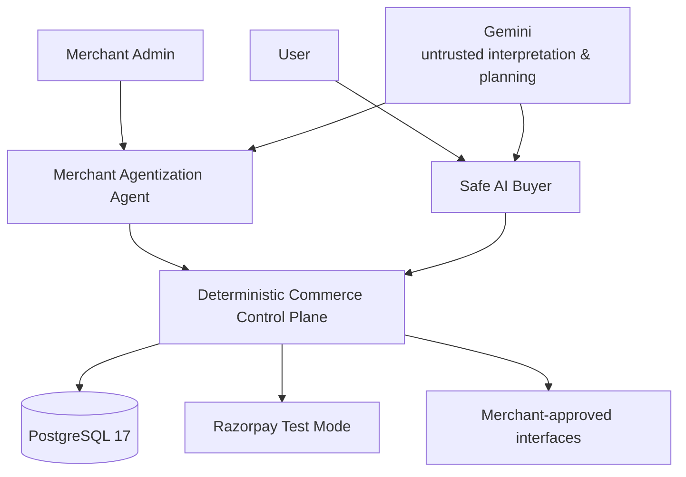

<p align="center">
  
</p>

<h1 align="center">Amana</h1>

<p align="center">
  <strong>Agentic commerce you can trust.</strong>
</p>

<p align="center">
  AI understands intent. Deterministic software controls truth, authority, and money.
</p>

---

## What is Amana?

**Amana is a control plane for safe agentic commerce.**

It solves both sides of the problem:

- **Merchant Agentization Agent** turns merchant-approved APIs, catalogues, and policies into tested, agent-readable commerce capabilities.
- **Safe AI Buyer** lets users discover and purchase through AI without giving the model authority over money.

The central rule is simple:

> **The AI may interpret, recommend, and plan. It cannot decide what is financially true or independently execute what was not authorized.**

```text
User intent
    ↓
Grounded merchant + product evidence
    ↓
Immutable Transaction Proposal
    ↓
Exact user authorization
    ↓
Deterministic Execution Gate
    ↓
Razorpay Test Mode
    ↓
Verified payment evidence
    ↓
Merchant fulfilment
```

**There is no AI → Razorpay authority path.**

---

## 60-second proof

Amana is not only a shopping demo. Its trust boundaries are tested independently of the LLM.

| Proof | Result |
|---|---:|
| Deterministic adversarial safety cases | **250 / 250 passed** |
| Hard safety violations | **0** |
| Guard-removal negative controls | **12 / 12 killed** |
| Concurrency scenarios | **10 / 10 passed** |
| Backend verification | **297 tests, 0 failures** |
| Frontend verification | **145 / 145 passed** |

The concurrency suite exercises **5 money-critical operations at N=8 and N=32 concurrent callers**, testing bounded execution and idempotent convergence.

The core safety proof runs offline:

```bash
pnpm proof:verify
```

It does not require Gemini, Razorpay, Vercel, Render, or production Supabase.

> These are repository-authored deterministic fixtures, not an independent security certification or production benchmark.

---

## What happens when the AI is wrong?

The important question is not whether an LLM can always behave correctly.

It cannot.

The question is whether an incorrect or manipulated model can cross a financial authority boundary.

### Example: the AI tries to change an authorized purchase

```text
User authorizes Proposal A
        ↓
Proposal A is canonically hashed
        ↓
execution attempts modified Proposal B
        ↓
authorization no longer binds
        ↓
EXECUTION DENIED
```

The same principle applies to:

- stale authorization;
- changed amount;
- duplicate checkout;
- fabricated products;
- webhook replay;
- wrong merchant/provider account;
- wrong currency;
- missing or ambiguous safety-critical evidence.

Unknown authority-critical state **fails closed**.

### Example: concurrent execution

```text
many callers
    ↓
same authorized transaction
    ↓
database constraints + locks + stable identities
    ↓
one converged financial execution
```

Amana treats retries and concurrency as normal payment-system behavior rather than exceptional cases.

---

## Why two agents?

### 1. Merchant Agentization Agent

Existing merchant APIs were written for applications and human operators, not autonomous buyers.

A schema looking plausible does **not** make an endpoint safe to expose to an AI.

Amana therefore operates only on **merchant-approved structured sources**.

```text
Inspect
  → Discover
  → Map
  → Test
  → Observe
  → Diagnose
  → Repair
  → Retest
  → Deterministically reduce readiness
```

The agent may reason about a failure and propose a repair.

It **cannot declare a capability READY**.

Readiness comes from deterministic evidence reduction.

### Example: bounded money-unit repair

A merchant returns:

```text
2999
```

for a ₹2,999 quote, while Amana's canonical contract expects minor units:

```text
299900
```

The agent may diagnose a rupees/paise mismatch and propose:

```text
amount_minor = amount_rupees × 100
```

But that semantic repair requires explicit merchant approval, creates a new mapping version, and must pass deterministic contract tests before becoming eligible.

Arbitrary website crawling is deliberately excluded as an authority source.

<p align="center">
  
</p>

---

### 2. Safe AI Buyer

The Buyer can understand typed, spoken, visual, multilingual, and conversational requests.

For example:

> Find me good wireless earphones under ₹3,000.

Gemini can interpret that request.

It cannot turn its own interpretation directly into a payment.

The Buyer must instead move through:

```text
Intent
  → eligible merchants
  → grounded catalogue records
  → authoritative quote
  → stock + serviceability + policy
  → immutable proposal
  → explicit authorization
  → execution gate
  → Razorpay
  → verified payment evidence
```

Product identity, exact money, authorization, and payment truth remain application-owned.

<p align="center">
  
</p>

---

## Payment truth

A browser saying **"payment succeeded"** is not financial truth.

Amana keeps separate evidence for:

- transaction proposal;
- authorization;
- execution;
- Razorpay order/payment state;
- callback/webhook observations;
- reconciliation;
- merchant fulfilment;
- refunds.

Razorpay callbacks and webhooks are treated as evidence that must be bound and reduced deterministically.

Ambiguous provider outcomes are reconciled instead of guessed.

Money-critical retries use stable identities, database constraints, and idempotent state transitions.

Durable post-commit work uses a **PostgreSQL transactional outbox**.

---

## Measured AI quality

The LLM is not trusted with authority, but its interpretation and retrieval quality still matter.

| Evaluation | Result |
|---|---:|
| Buyer intent field accuracy | **92.41%** |
| Budget extraction | **100%** |
| Labelled multilingual intent subset | **100%** |
| Hybrid-v3 valid-product Recall@5 | **76.12%** |
| Previous hybrid-v2 valid-product Recall@5 | **55.22%** |
| Exact-identity precision | **100%** |
| Valid no-match accuracy | **100%** |
| Fabricated valid products observed | **0** |
| Wrong valid product / variant observed | **0** |

These measurements use repository-authored labelled datasets and are reported as fixture measurements, not generalized production claims.

**Semantic similarity helps discover candidates. It never creates authority.**

---

## Architecture



### Deterministic control plane owns

- merchant capability readiness;
- catalogue and policy evidence;
- product identity;
- authoritative quotes;
- immutable transaction proposals;
- authorization;
- execution and idempotency;
- payment evidence reduction;
- reconciliation;
- transactional outbox work;
- refunds.

The backend is a **Java 25 / Spring Boot 4.1.1 modular monolith** with PostgreSQL as the system of record.

This was deliberate: authority-critical invariants remain inside explicit module and transaction boundaries without introducing unnecessary distributed-system failure modes.

<p align="center">
  
</p>

---

## Try Amana

| Experience | Link |
|---|---|
| **Live product** | [agentic-commerce-gateway-web.vercel.app](https://agentic-commerce-gateway-web.vercel.app/) |
| **Safe AI Buyer** | [/buyer/chat](https://agentic-commerce-gateway-web.vercel.app/buyer/chat) |
| **Merchant Agentization** | [/merchant](https://agentic-commerce-gateway-web.vercel.app/merchant) |
| **Safety Proof** | [/proof](https://agentic-commerce-gateway-web.vercel.app/proof) |
| **Security / Red Team** | [/security](https://agentic-commerce-gateway-web.vercel.app/security) |
| **Failure Lab** | [/failure-lab](https://agentic-commerce-gateway-web.vercel.app/failure-lab) |
| **Architecture** | [/architecture](https://agentic-commerce-gateway-web.vercel.app/architecture) |
| **Performance** | [/performance](https://agentic-commerce-gateway-web.vercel.app/performance) |

> The Render backend uses a free tier and can take a few minutes to wake after inactivity. If the demo is asleep, open `https://agentic-commerce-gateway.onrender.com/actuator/health`, wait until it returns `{"status":"UP"}`, then reopen Amana.

### Fastest reviewer path

#### 1. Buyer

Open the Safe AI Buyer and ask for:

> Auralink Buds Bluetooth Earphones under ₹3,000

Follow the request through:

**grounded discovery → proposal → authorization → Razorpay Test Mode**

#### 2. Merchant

Open the Merchant Agentization workspace and replay the bounded:

**`2999 → 299900` money-unit repair**

#### 3. Proof

Open `/proof` and `/security`, or run:

```bash
pnpm proof:verify
```

---

## Failure recovery

Amana explicitly models failures that are dangerous in payment systems:

- provider timeout after a local commit;
- duplicate or concurrent execution;
- stale authorization;
- webhook replay;
- wrong provider account;
- wrong currency;
- missing evidence;
- repeated outbox delivery;
- repeated refund request;
- merchant failure after payment.

The system prefers **UNKNOWN + reconciliation** over inventing certainty.

---

## Security / trust principles

- **Identity before authority:** server-backed sessions, Argon2 password verification, session fixation protection, CSRF, and role-specific APIs.
- **Tenant isolation:** Merchant Admin access is backed by explicit merchant membership.
- **Approved-source execution:** merchant endpoints are allowlisted, HTTPS-only, SSRF-checked, DNS-pinned, and redirect-free.
- **Fail-closed evidence:** missing or safety-critical `UNKNOWN` evidence blocks readiness, proposals, and execution.
- **Immutable transaction intent:** canonical proposal hashes and expiring decisions prevent stale approval reuse.
- **Provider evidence over browser claims:** payment success is reduced from bound Razorpay payment and order facts.
- **Idempotent money movement:** execution, provider order, outbox work, and refund retries use stable identities and database constraints.
- **Auditable lifecycle:** proposal, authorization, payment, fulfilment, and refund records retain separate state and evidence lineage.

No compliance certification is claimed.

---

## Technology

| Layer | Technology |
|---|---|
| Frontend | Next.js 16.2.11, React 19.2, TypeScript 5.9, Tailwind CSS 4 |
| Design system | Razorpay Blade |
| Backend | Java 25, Spring Boot 4.1.1 |
| Database | PostgreSQL 17 locally; Supabase PostgreSQL for deployment |
| AI | Gemini reasoning, vision, and Live native audio |
| Retrieval | PostgreSQL FTS, `pg_trgm`, `pgvector`, Gemini embeddings |
| Payments | Razorpay Orders + Standard Checkout in Test Mode |
| Reliability | Transactions, row locks, unique constraints, immutable evidence, transactional outbox |
| Testing | JUnit 5, Testcontainers PostgreSQL, Node test runner |
| Deployment | Vercel web, Render backend, Supabase PostgreSQL |

No Kafka, BullMQ, or Redis service is required for P0.

---

## Verification

The suites below measure different things and are intentionally not added into one marketing total.

| Suite | Current verified result | Purpose |
|---|---:|---|
| Backend | **297 tests; 0 failures, 0 errors, 2 skipped** | Unit/integration coverage, including real PostgreSQL via Testcontainers |
| Frontend | **145 passed; 0 failed, 0 skipped** | Buyer, Merchant, Proof, Security, Architecture, Failure Lab, and Performance UI contracts |
| Deterministic safety proof | **250 / 250 passed** | Adversarial cases against production safety reducers and guards |

Run the suites:

```powershell
cd apps/backend
.\mvnw.cmd test
```

```powershell
pnpm web:test
```

```powershell
pnpm proof:verify
```

---

## Repository structure

```text
.
├── apps/
│   ├── backend/        # Spring Boot deterministic control plane
│   └── web/            # Buyer, Merchant, landing, and evidence surfaces
├── evaluation/
│   ├── demo-data/      # synthetic merchant/product fixtures
│   └── retrieval/      # grounded retrieval evaluation seeds
├── proof/results/      # generated safety/evaluation evidence
├── docs/readme/        # reviewer-facing screenshots
├── PROJECT_SPEC.md
├── DECISIONS.md
└── CONTEXT.md
```

---

## Run locally

### Requirements

- Java 25
- Node.js 24.19.x
- pnpm 10.15.0
- Docker with Compose

### 1. Install and configure

```powershell
corepack enable
pnpm install --frozen-lockfile
Copy-Item .env.example .env
```

### 2. Start PostgreSQL

```powershell
docker compose --env-file .env -f infra/compose.yml up -d
```

### 3. Start the backend

```powershell
cd apps/backend
.\mvnw.cmd spring-boot:run
```

### 4. Start the web application

```powershell
pnpm web:dev
```

### 5. Validate

```powershell
pnpm web:check
pnpm web:test
pnpm proof:verify
```

```powershell
cd apps/backend
.\mvnw.cmd test
```

Tests whose correctness depends on PostgreSQL transactions, locks, constraints, types, extensions, or `SKIP LOCKED` use real PostgreSQL through Testcontainers.

---

## Current scope

The public system intentionally uses:

- synthetic demo merchants and products;
- Razorpay Test Mode;
- merchant-approved structured sources rather than arbitrary web crawling;
- explicit on-screen authorization for current purchases.

Unattended scheduled AutoBuy and native Buyer clients remain future directions.

No production revenue, security certification, or compliance certification is claimed.

---

## The principle behind Amana

> **Don't make the model the authority just because it is intelligent enough to participate.**

**Amana lets AI reason about commerce while deterministic software retains control of truth, authority, and money.**
