<p align="center">
  
</p>

<h1 align="center">Amana</h1>

<p align="center">
  <strong>Commerce you can trust agents with.</strong>
</p>

Amana turns existing merchants into verified AI-transactable businesses, then lets customers discover, reason, and purchase through a multimodal AI Buyer. Language models interpret and plan; deterministic application logic controls capability readiness, product and policy evidence, transaction authority, payment truth, and recovery.

> **AI handles unstructured meaning and planning. Deterministic software controls truth, authority and money.**

## Live Demo

> **Note:** The backend runs on Render’s free tier and may be asleep after inactivity.
> If the demo shows `429 Too Many Requests` or login temporarily fails:
>
> 1. Open: https://agentic-commerce-gateway.onrender.com/actuator/health
> 2. Wait up to 2–3 minutes for the backend to wake.
> 3. Once it returns `{"status":"UP"}`, reopen Amana and continue.

| Experience | Link |
|---|---|
| **Live product** | [agentic-commerce-gateway-web.vercel.app](https://agentic-commerce-gateway-web.vercel.app/) |
| **Safety proof** | [/proof](https://agentic-commerce-gateway-web.vercel.app/proof) |
| **Safe AI Buyer** | [/buyer/chat](https://agentic-commerce-gateway-web.vercel.app/buyer/chat) |
| **Merchant** | [/merchant](https://agentic-commerce-gateway-web.vercel.app/merchant) |

The Buyer and Merchant sign-in screens include reviewer demo-access controls when the public demo configuration is present. Those controls fill the normal form only: the reviewer still submits credentials through the same Spring Security authentication, session, CSRF, and role checks as every other user.

<p align="center">

  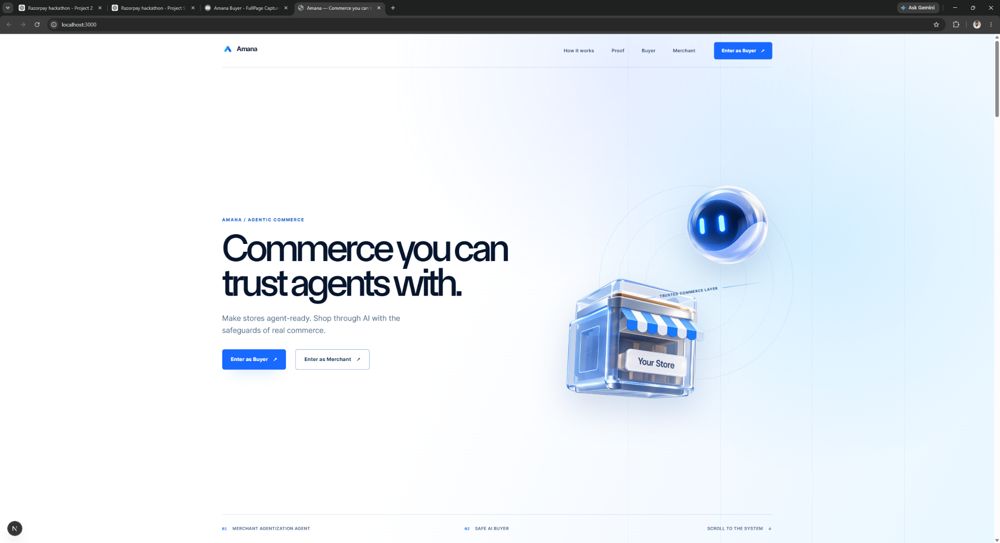

</p>

## The Problem

**AI can understand what someone wants, but neither a plausible API nor a fluent recommendation is authority to transact.** Trustworthy agentic commerce has to solve the merchant boundary and the buyer boundary together.

### For merchants

Existing merchant systems were built for applications and human operators, not autonomous AI buyers. Every integration can differ in:

- API shapes and catalogue schemas;
- capability and availability semantics;
- major versus minor money units;
- inventory and fulfilment behavior;
- cancellation, return, shipping, and safety policies;
- endpoint, credential, and tenant boundaries.

An endpoint that looks like `getQuote` is not necessarily correct, current, or safe to advertise. An LLM cannot declare it transaction-ready merely because the schema appears plausible.

### For buyers

An AI can understand:

> Find me good wireless earphones under ₹3,000.

Understanding that sentence is not equivalent to safely spending money. A purchase must be grounded in an eligible merchant, an exact product, a current authoritative quote, stock, serviceability, applicable policy, a bounded transaction scope, fresh user authorization, and verified payment evidence. A shopping chatbot with a checkout button leaves those authority transitions implicit; Amana makes them explicit and testable.

## Our Solution

**Two agents connected through one deterministic commerce control plane.**

1. **Merchant Agentization Agent** — inspects merchant-approved sources, discovers and maps canonical capabilities, runs contract tests, records evidence, proposes bounded repairs, and asks for merchant authority where semantics affect commerce.
2. **Safe AI Buyer** — turns typed, spoken, or visual requests into structured intent; discovers agent-ready merchants and grounded products; then advances through proposal, authorization, Razorpay payment, and lifecycle state without giving the model financial authority.

There are exactly two P0 runtime commerce agents. Shared services underneath them own identity, tenant access, catalogue and policy evidence, readiness reduction, transaction proposals, authorization, execution, payments, reconciliation, outbox work, and refunds.

## Razorpay Buildathon Alignment

Amana addresses the **AI Growth & Agentic Commerce** problem from both directions: it makes existing merchants safely transactable by AI buyers, and it gives an AI Buyer a controlled path from intent to Razorpay payment.

| Criterion | What it asks | How Amana answers |
|---|---|---|
| **Build quality** | Does it run? Is it structured? Would you trust it? | A deployed end-to-end product with authenticated Buyer and Merchant experiences, PostgreSQL authority, real Razorpay Test Mode checkout, deterministic safety boundaries, and broad automated coverage. |
| **AI judgment** | Is the right tool used in the right place—and deliberately not used elsewhere? | Gemini handles language, native-audio conversation, visual interpretation, merchant-interface reasoning, and bounded planning. Deterministic code owns capability readiness, authorization, exact money, payment truth, and refunds. |
| **Failure recovery** | What breaks, and how does the system recover? | Bounded repair and retest loops, fail-closed `UNKNOWN`, stable idempotency, provider reconciliation, evidence-based webhook reduction, transactional outbox processing, refund accounting, and safe voice fallback. |

## Measured Evidence

Amana is evaluated beyond happy-path demos. The repository includes reproducible measurements for retrieval quality, intent understanding, safety detection, concurrency, latency, and automated verification.

| Evidence | Measured result | What it shows |
|---|---:|---|
| **Deterministic safety proof** | **250 / 250 passed** | Safety invariants hold across the deterministic proof suite |
| **Hybrid retrieval Recall@5** | **74.63%** | Grounded hybrid retrieval on an 80-case labelled Amazing catalogue evaluation |
| **Lexical-only Recall@5** | **53.73%** | Baseline using lexical retrieval without vector assistance |
| **Hybrid retrieval improvement** | **+20.9 percentage points** | Semantic retrieval materially improved candidate discovery on the labelled set |
| **Generic-category retrieval** | **100%** | Category + budget queries succeeded in the hybrid evaluation |
| **Typo / ASR-style retrieval** | **100%** | Retrieval tolerated labelled spelling and speech-recognition-style variations |
| **Fabricated products** | **0 observed** | No product outside the authoritative catalogue was invented in the labelled retrieval set |
| **Intent field accuracy** | **93.1%** | Gemini compiled labelled buyer utterances into the typed intent contract with high field accuracy |
| **Budget extraction** | **100%** | Budget constraints were correctly extracted in the labelled intent evaluation |
| **Context / correction accuracy** | **100%** | Follow-up corrections correctly replaced prior material values |
| **Authorization-skip attempts** | **0 / 3 gained authority** | Language such as “just buy it” did not bypass explicit authorization |
| **Negative controls** | **12 / 12 mutations killed** | Selected safety tests detect intentionally weakened guards rather than merely passing |
| **Concurrency** | **5 critical operations passed at N=8 and N=32** | Execution, provider-order creation, webhook ingestion, outbox claims, and refund reservation converged correctly under concurrent callers |
| **Backend verification** | **258 tests, 0 failures, 0 errors** | Current backend verification remains green |
| **Frontend verification** | **88 / 88 passed** | Buyer and Merchant frontend suites remain green |
| **Offline proof command** | **`pnpm proof:verify` passes** | Core evidence can be reproduced without Gemini, Razorpay, Vercel, Render, or production Supabase |

### Measured latency

Local deterministic/stub measurements were collected on Java 25 + PostgreSQL 17 Testcontainers after one warm-up run.

| Path | p50 | p95 |
|---|---:|---:|
| Intent compilation | 9.66 ms | 10.69 ms |
| Catalogue retrieval | 12.66 ms | 14.89 ms |
| Candidate cart | 24.47 ms | 30.57 ms |
| Authoritative quote | 12.55 ms | 13.36 ms |
| Constraint verification | 17.95 ms | 19.01 ms |
| Proposal construction | 16.94 ms | 22.73 ms |
| Execution gate | 15.52 ms | 23.67 ms |
| Razorpay order boundary (stub) | 9.83 ms | 12.54 ms |

A separate provider-backed Gemini intent run across **52 labelled utterances** measured:

- **p50:** 4.87 s
- **p95:** 12.44 s
- **Provider errors / rate limits:** 0 / 0

These are measured evaluation results, **not production SLAs**.

### Reproduce the evidence

```bash
pnpm proof:verify
```

Provider-backed evaluation is intentionally separate:

```bash
pnpm proof:evaluate
```

Detailed artifacts are available under:

- `proof/results/SCORECARD.md`
- `proof/results/retrieval.json`
- `proof/results/intent-eval.json`
- `proof/results/mutation.json`
- `proof/results/concurrency.json`
- `proof/results/latency.json`
- `proof/results/latest.json`

> The evaluation datasets are repository-authored labelled fixtures, not independent third-party benchmarks. Metrics are reported as measured rather than generalized beyond the tested sets.

## End-to-End Journey

### 1. Reviewer access and authentication

Buyer and Merchant use separate authenticated product surfaces backed by the same server security boundary:

- credentials are verified by Spring Security;
- successful login establishes a server-backed JDBC session and rotates the session identifier;
- browser mutations use CSRF protection;
- Buyer and Merchant Admin roles are enforced at the API boundary;
- merchant data is scoped to explicit Merchant Admin membership;
- demo controls populate credentials but never create a session, assign a role, or submit automatically.

<p align="center">

  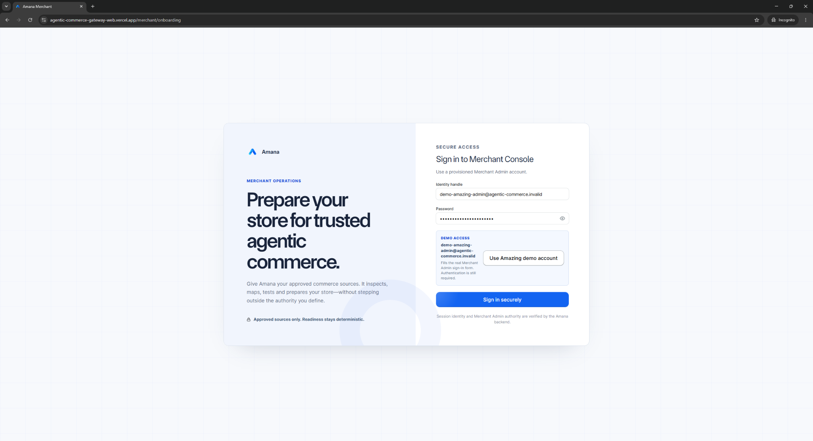

</p>

### 2. Merchant onboarding and authority setup

The Merchant setup journey captures the boundary Amana is allowed to use:

1. store identity and commerce context;
2. approved structured sources such as OpenAPI, catalogue, and policy references;
3. an approved endpoint and credential reference—never raw credential material in the review surface;
4. an authority review before handoff;
5. a deliberate start-agentization step.

For the configured reviewer identity, **Load Amazing demo setup** resolves the existing canonical **Amazing** merchant from the authenticated actor's administered-merchant list. It pre-fills only grounded merchant identity, does not create or mutate a merchant, and selects that existing merchant only after the reviewer continues. The guided tour then introduces the shared Merchant workspace and its evidence surfaces.

<p align="center">

  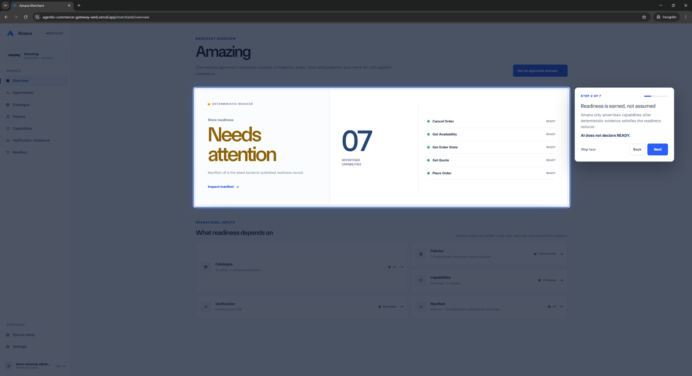

</p>

### 3. Agentize, discover, propose, authorize, pay

Amazing's approved interface is inspected and reduced into evidence-backed capabilities. The Buyer asks for a product, Amana searches only eligible merchant/catalogue state, refreshes executable evidence, prepares an immutable proposal, and waits for explicit authorization. Only then can the one authorized execution open Razorpay Standard Checkout. Provider evidence and merchant finalization progress independently after payment submission.

## Merchant Agentization Agent

<p align="center">

  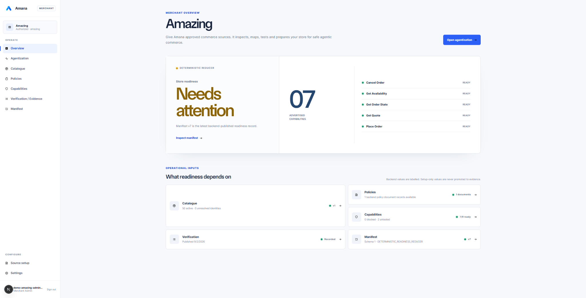

</p>

**Needs attention is a safety feature.** Amana does not equate “an endpoint exists” with “an AI may transact through it.” A capability remains unadvertised until its current mapping, tests, policy, catalogue, and other required evidence satisfy the deterministic readiness reducer.

The agentization loop is:

**Inspect → Discover → Map → Test → Observe → Diagnose → Repair → Retest → Reduce**

- **Inspect approved sources.** OpenAPI input is bounded, locally resolved, and associated with an approved merchant endpoint. Arbitrary website crawling is not an authority source.
- **Discover canonical capabilities.** Merchant operations are related to known commerce capabilities rather than exposed as unconstrained tools.
- **Propose and validate mappings.** Structured mapping versions bind source fields and a small allowlist of deterministic transformations to a canonical contract.
- **Run contract tests.** Schema shape is not enough; Amana executes bounded tests and records immutable observations and evidence hashes.
- **Diagnose failures.** The agent may classify a mismatch and propose a repair, but cannot publish readiness.
- **Require merchant authority.** Money-affecting or otherwise material semantic changes require an explicit decision bound to the exact mapping version and content hash.
- **Retest and reduce.** A new mapping version must pass deterministic tests. Only the readiness reducer may publish `READY`, `BLOCKED`, or `UNTESTED` and produce a versioned Agent Commerce Manifest.
- **Stop unbounded loops.** Repeated identical failures, step-budget exhaustion, or missing evidence move the run to clarification or a terminal bounded state.

### A bounded money-unit repair

<p align="center">

  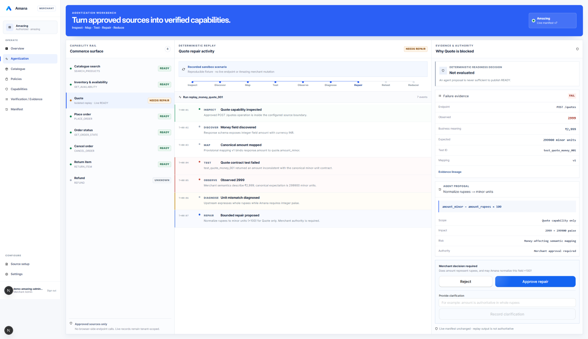

</p>

The reviewer replay demonstrates a concrete semantic failure. The merchant returns `2999` for a ₹2,999 quote, while Amana's canonical money contract requires `299900` minor units.

1. The agent discovers the response field.
2. It proposes a canonical mapping.
3. The contract test observes the mismatch.
4. Diagnosis identifies whole rupees versus paise.
5. A bounded transform is proposed: `amount_minor = amount_rupees × 100`.
6. The Merchant must approve that exact repair.

The model's diagnosis is useful, but it is not the readiness verdict.

<p align="center">

  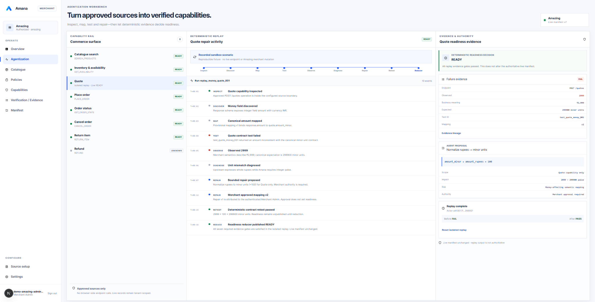

</p>

After approval, the repair becomes a new version, the deterministic quote contract is retested, and the reducer checks all required evidence gates. The isolated reviewer replay reaches `READY` only when those gates pass; it explicitly does **not** mutate Amazing's authoritative live manifest. In live operation, only the backend deterministic readiness service publishes the current manifest and exposes advertised `READY` capabilities to buyers.

## Safe AI Buyer

The Buyer is a persistent commerce workspace, not a stateless recommendation box. Conversations and commerce requests have durable identities so a user can follow, restore, clarify, or resume work safely.

<p align="center">

  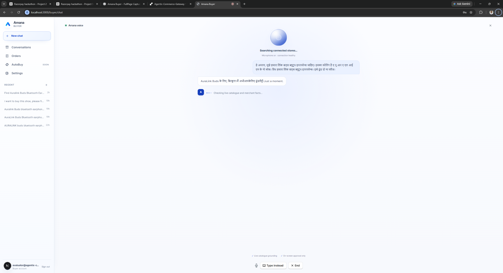

</p>

A Buyer request moves through these boundaries:

1. **Understand intent.** Gemini compiles language into a bounded typed intent with material-field evidence and explicit ambiguity.
2. **Discover eligible merchants.** Buyer discovery consumes the current Agent Commerce Manifest and filters for advertised `READY` capabilities.
3. **Retrieve grounded products.** PostgreSQL full-text search, trigram similarity, and optional Gemini embeddings form a hybrid ranker. Embedding failure falls back to lexical retrieval rather than fabricating a result.
4. **Protect exact identity.** SKU, GTIN, brand/variant, size, color, category, and substitution constraints are checked against authoritative catalogue records. A similar result is never silently treated as the requested variant.
5. **Build a candidate cart.** Selection is bounded to one merchant and exact product records, with an explicit no-match or clarification path.
6. **Refresh authority.** The backend obtains a current merchant quote and validates executable money and line items; it refreshes availability and serviceability and evaluates current policy/hard constraints.
7. **Prepare a proposal.** Material evidence is bound into an immutable transaction proposal and hash.
8. **Ask the user.** A visible authorization boundary separates “the AI recommends this” from “the buyer authorizes this transaction.”
9. **Execute once.** The Execution Gate revalidates the proposal and evidence before reserving a stable execution and provider-order intent.
10. **Verify and fulfil.** Razorpay evidence is reconciled, then merchant fulfilment proceeds through durable outbox work.

<p align="center">

  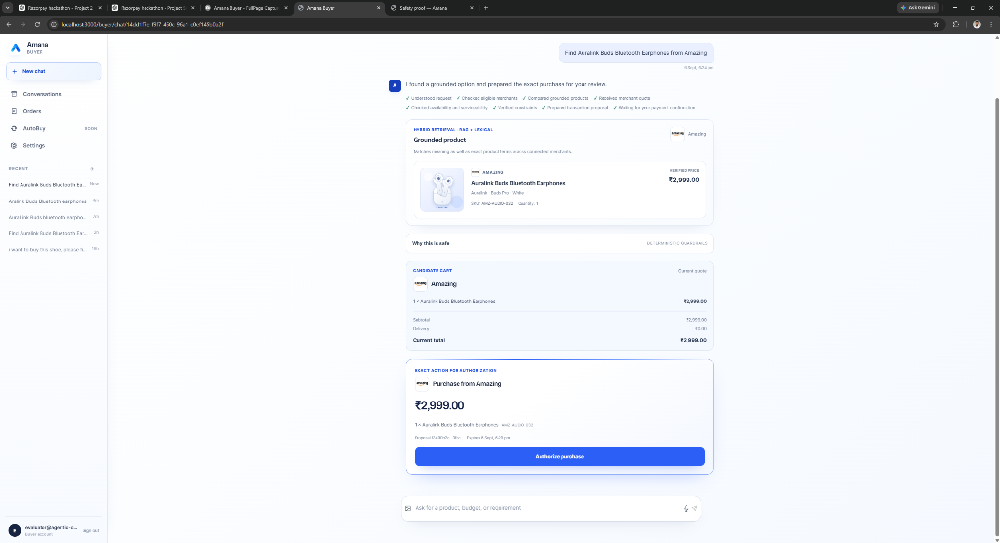

</p>

The proposal shown for **Auralink Buds Bluetooth Earphones** (SKU `AMZ-AUDIO-032`, ₹2,999 in the canonical Amazing fixture) is grounded before authorization. No money action occurs merely because the AI found or suggested it.

## Multimodal + Multilingual

### Multimodal input, one authority path

The Buyer accepts typed language, realtime voice, image/product visual input, and conversational corrections. Each surface produces a hypothesis or structured request; none creates authoritative commerce facts.

Visual interpretation may suggest a category, brand, variant, or search intent. It never becomes authoritative product identity, price, stock, serviceability, policy, authorization, or payment truth. The request still passes through merchant readiness, catalogue grounding, current evidence, proposal, and authorization.

### Realtime voice with Gemini Live

<p align="center">

  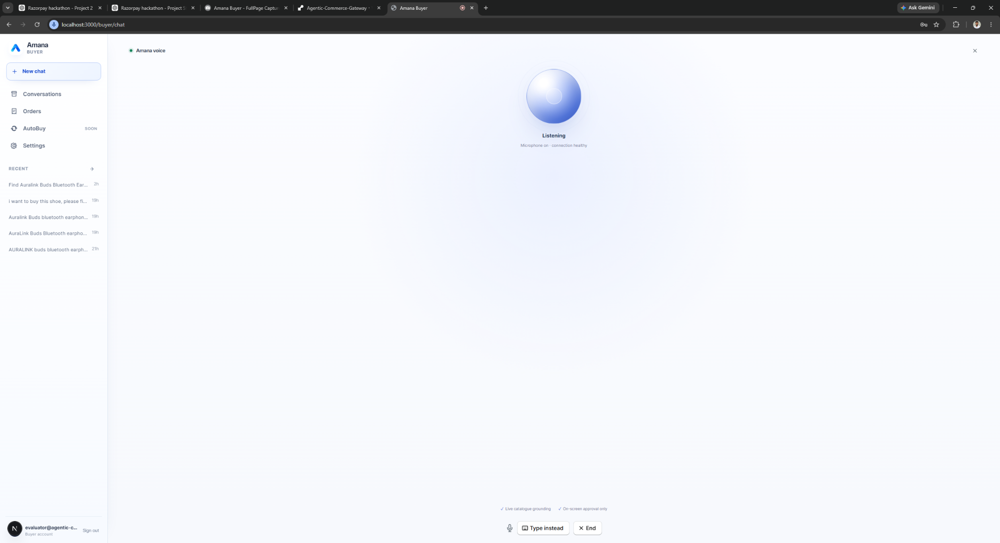

</p>

The current P0 Buyer voice path uses Gemini Live model **`gemini-3.1-flash-live-preview`** with native audio input/output. The current implementation includes:

- server voice-activity detection for speech boundaries;
- realtime transcription and conversational audio;
- interruption/barge-in handling and playback cancellation;
- natural language switching during a session;
- selectable persisted voices;
- one bounded application tool, `start_commerce_request`;
- same-session Buyer/CSRF validation before a short-lived Live connection is created;
- reconnect, retry, and **Type instead** recovery when media or the Live session degrades.

The tool only starts the authenticated application's commerce request. Gemini receives the completed application result later and may narrate only those returned facts. Spoken intent cannot authorize a purchase; on-screen approval and Razorpay remain separate.

> **Multilingual reasoning changes how users communicate with Amana. It does not change the deterministic commerce authority underneath.**

## Transaction Authority

Amana makes the spending boundary explicit:

```text
TransactionProposal  →  AuthorizationDecision  →  Execution
```

- **TransactionProposal:** immutable canonical material binds the Buyer, thread, merchant, exact cart lines, quote and expiry, availability, serviceability, policy snapshot, fulfilment/address/account-link snapshot, constraints, action, amount, and currency. A canonical hash covers the material fields.
- **AuthorizationDecision:** records explicit approval or denial against the actor, session binding, proposal ID, proposal hash, action type, issue time, and expiry. Stale or changed material requires new authority.
- **Execution:** the Execution Gate reloads and validates every dependency, denies missing/expired/mismatched evidence, and reserves one execution with a stable idempotency identity. Duplicate calls converge on that same reservation instead of creating another provider order.

`FAIL` and safety-critical `UNKNOWN` never become permission to spend.

## Razorpay Payment Integration

<p align="center">

  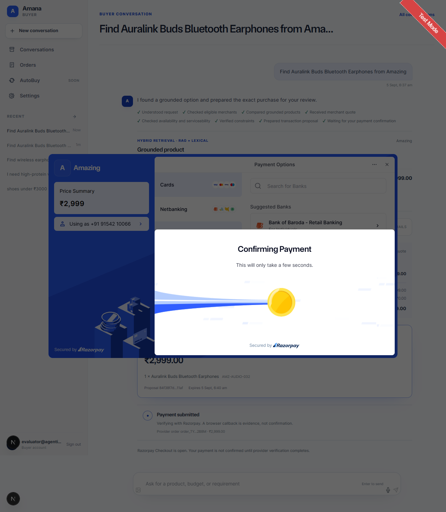

</p>

Amana uses real **Razorpay Test Mode** Orders and Standard Checkout—not a simulated payment modal.

- the backend derives the amount, currency, receipt, merchant payment configuration, and stable execution idempotency reference;
- one execution can own at most one Razorpay Order intent;
- an unknown create-order outcome is reconciled before any new order is attempted;
- the browser submits signed Checkout callback material, which is validated and stored as evidence;
- signed Razorpay webhooks are size-bounded, signature-verified, normalized, and deduplicated;
- provider API reconciliation records current payment and order evidence;
- the deterministic reducer requires the expected merchant configuration/account, provider order, exact amount, exact currency, `payment.status = captured`, and `order.status = paid` before publishing `PAYMENT_CONFIRMED`.

> **A browser callback is evidence, not payment truth.**

Payment confirmation and merchant fulfilment confirmation are different states. If payment is verified but merchant finalization fails, Amana preserves the payment truth and keeps fulfilment pending for durable retry or explicit compensation handling. It does not pretend that a captured payment never happened.

## Failure Handling & Recovery

Failure recovery is designed into the state model rather than added as generic retry behavior.

| Failure or uncertainty | Amana behavior |
|---|---|
| Malformed AI structured output | Strict schema/domain validation, one bounded repair attempt for Buyer intent, then `INVALID_BUYER_INTENT`; no authority is created. |
| AI provider unavailable or rate-limited | Explicit unavailable/rate-limited result; nothing is authorized. |
| Repeated agentization failure | Identical failure signatures are counted; after the bounded threshold the run waits for Merchant clarification instead of looping. |
| Merchant money-unit mismatch | Contract test detects the mismatch, the agent diagnoses it, a bounded versioned repair is proposed, Merchant approval is required, and a deterministic retest follows. |
| Missing capability evidence | Capability remains `UNTESTED`/unadvertised rather than being inferred `READY`. |
| Stale mapping approval | Approval is bound to merchant, mapping ID, version, and content hash; stale authority cannot approve a changed mapping. |
| Missing or conflicting policy fact | The hard constraint remains `UNKNOWN`/blocking and fails closed. |
| No trustworthy product match | Returns an explicit no-match/clarification path; it does not manufacture a candidate. |
| Similar but wrong product variant | Exact-identity and substitution gates prevent a related item from silently becoming the requested one. |
| Embedding provider failure | Hybrid retrieval records vector fallback and continues with deterministic lexical candidates. |
| Stale quote | Preparation/execution rejects expired or insufficiently fresh quote evidence and requires a refresh/new proposal. |
| Inventory disappears | Availability evidence is refreshed; a non-`PASS` result blocks payment progression. |
| Serviceability uncertainty | A missing, stale, mismatched, or non-`PASS` result fails closed. |
| Proposal changes after approval | Proposal-hash/session/action binding invalidates the old authorization; changed material requires a new proposal and decision. |
| Expired authorization | Execution Gate denies the request. |
| Duplicate execution | PostgreSQL uniqueness and stable idempotency converge on the existing execution. |
| Lost Razorpay Order response | The persisted initiation attempt is reconciled before another provider order can be created. |
| Browser callback | Signature-checked evidence only; never sufficient by itself for payment confirmation. |
| Invalid webhook signature | Rejected before event processing. |
| Duplicate webhook | Stable event identity/body hash makes handling idempotent. |
| Out-of-order webhook | Immutable evidence is reduced from current facts, not naïve arrival order. |
| Account/order/amount/currency mismatch | Inconsistent evidence is rejected or remains `PAYMENT_UNCERTAIN`. |
| Authorized but not captured | Not treated as financial success. |
| Captured payment with inconsistent order state | Remains uncertain and enters reconciliation instead of being trusted blindly. |
| Late capture or ambiguous provider outcome | Explicit bounded provider reconciliation, then pending/manual-review status if truth remains unavailable. |
| Merchant finalization failure after payment | Payment stays confirmed; fulfilment remains pending and is retried independently. |
| Crash after transaction commit | PostgreSQL transactional outbox preserves committed follow-up work for a later worker lease. |
| Refund timeout or retry | Stable refund execution, request bytes, and idempotency key are reused within a bounded attempt/deadline budget. |
| Concurrent refunds | A PostgreSQL refund ledger and locking reserve authority and prevent total pending-plus-completed refunds from exceeding the captured refundable amount. |
| Ambiguous refund evidence | Stays pending/reconcilable; `REFUNDED` requires evidence bound to payment, amount, currency, and provider account. |
| Unsafe merchant endpoint | HTTPS-only canonicalization, DNS/IP checks, unsafe-address rejection, DNS-pinned transport, and no redirects defend the approved endpoint boundary. |
| Wrong tenant or merchant | Role checks plus actor-to-merchant membership and tenant-scoped queries deny cross-merchant access. |
| Degraded realtime voice | Audio is stopped safely and the user can retry the session or continue by typing; commerce state remains application-owned. |

### What actually broke while we built Amana

The recovery model above was not only designed on paper. Several real integration failures shaped the final system:

- **Vercel → Render trailing-slash authorization bug.** Merchant access worked locally, but the deployed Next.js wildcard rewrite forwarded the root Merchant request as `/api/merchants/`. Spring Security intentionally authorized the exact `/api/merchants` route, so the deployed request fell through to `denyAll()` despite a valid `ROLE_MERCHANT_ADMIN` session. Render security logs exposed the path mismatch; the fix was an explicit exact-root proxy rewrite rather than weakening backend authorization.
- **Gemini Live acknowledgement race.** Commerce work could begin before the spoken acknowledgement had actually drained from playback, producing `ACKNOWLEDGEMENT_AUDIO_NOT_COMPLETED`. The fix was a monotonic PCM playback-watermark barrier that waits only for the pre-tool acknowledgement prefix, not arbitrary later model audio.
- **Gemini Live session degradation.** One long-running Live session degraded to roughly 10–30 second responses while fresh sessions remained fast. Amana therefore classifies session health and recovers by creating a fresh constrained Live session seeded only with compact deterministic application state—without replaying transcript or audio history.
- **A positive-path safety fixture became stale as invariants hardened.** After stronger proposal, policy, and availability requirements landed, an older test fixture no longer satisfied the real authority boundary. The fixture was repaired with the missing legitimate evidence instead of weakening production checks; the final backend suite returned to 251 passing tests.

## Deterministic Safety Proof

### Safety is measured, not claimed.

<p align="center">

  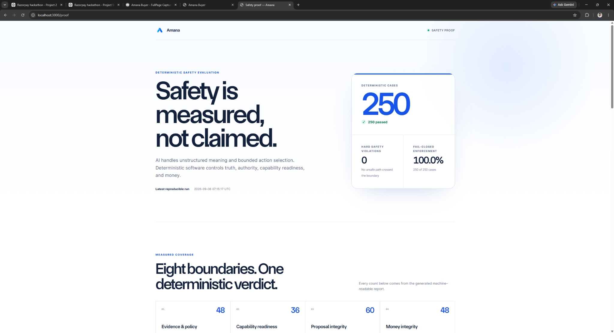

</p>

The offline `amana-safety-proof-v1` harness exercises production deterministic reducers and guards with inert repository/provider boundaries. Fixtures may supply records and capture effects, but they do not supply a safety verdict. The harness requires no model, external API, Docker, PostgreSQL, Razorpay credential, or production payment mutation.

| Safety metric | Result |
|---|---:|
| Deterministic cases | **250 / 250 passed** |
| Hard safety violations | **0** |
| Fail-closed enforcement | **100%** |
| Deterministic invariants defended | **15** |
| Boundary | Cases |
|---|---:|
| Evidence & policy | **48** |
| Capability readiness | **36** |
| Proposal integrity | **60** |
| Money integrity | **48** |
| Callback truth | **12** |
| Payment idempotency | **16** |
| Refund integrity | **20** |
| Refund idempotency | **10** |
| **Total** | **250** |

The generated report lives in [`proof/results/SUMMARY.md`](proof/results/SUMMARY.md), with machine-readable results in [`proof/results/latest.json`](proof/results/latest.json). These are deterministic safety cases, not the ordinary backend JUnit count.

## Architecture

### Merchant-side architecture

<p align="center">

  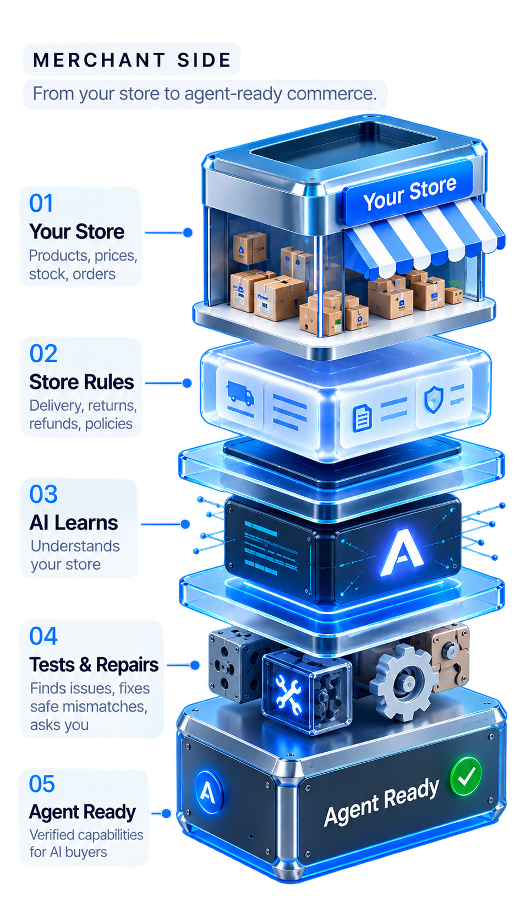

</p>

The Merchant Agentization Agent operates through a typed, bounded tool registry. It inspects approved inputs, proposes mappings, invokes deterministic validators and contract tests, records evidence, pauses for merchant clarification/approval, and hands readiness publication to the reducer.

### Buyer-side architecture

<p align="center">

  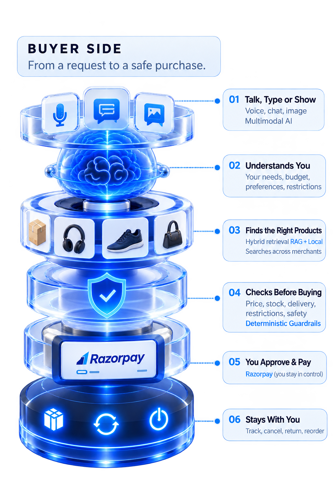

</p>

The Safe AI Buyer uses Gemini for intent, vision, and realtime interaction, then relies on application-owned discovery, catalogue retrieval, executable evidence refresh, risk reduction, proposal authority, Razorpay payment evidence, and lifecycle services.

### Shared deterministic control plane

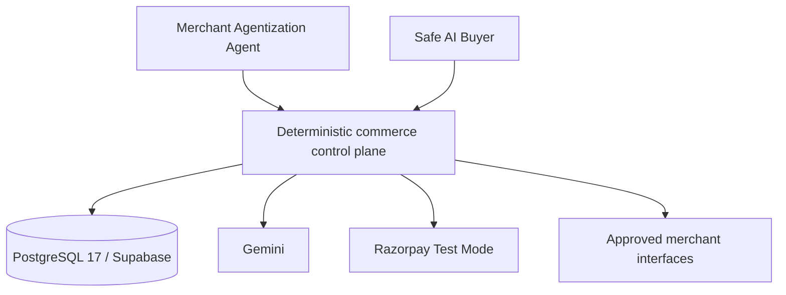

The backend is a **Java 25 / Spring Boot 4.1.1 modular monolith** using Spring JDBC and explicit SQL for authority-critical paths. This keeps proposal, authorization, execution, payment evidence, outbox, and refund invariants inside clear module boundaries and shared PostgreSQL transactions—without adding distributed-system failure modes before the product needs them.

## Razorpay Blade

Amana uses **Razorpay Blade** (`@razorpay/blade` 12.121.1) as the provider and for core interactive primitives across the Buyer and Merchant applications, including buttons, text/password inputs, icons, checkboxes, tooltips, and selected navigation/workbench controls. Amana layers its own product typography, spacing, composition, and states around those primitives. The public editorial landing page is custom-rendered, so the README does not claim every visible element is a Blade component.

## Business Impact

These are product implications of the implemented mechanisms, not measured conversion or revenue claims.

### For merchants

- expose existing APIs, catalogues, policies, and operations to AI buyers without rebuilding a storefront for every agent;
- turn heterogeneous commerce interfaces into canonical, testable capabilities;
- surface integration gaps instead of silently assuming compatibility;
- retain explicit Merchant control over money-affecting semantic repairs;
- create an additional discovery and acquisition surface;
- reuse one agentization and evidence model instead of building bespoke trust logic for every AI channel.

### For buyers

- move from intent → discovery → grounded proposal → payment in one persistent conversation;
- reduce category/filter/cart navigation without removing review and approval;
- use typed, visual, realtime voice, and multilingual interaction;
- preserve shopping context across follow-ups and corrections;
- see a concrete proposal before any purchase authority exists.

### For payment and platform engineering

- keep exact money and payment truth outside the model;
- audit who authorized which immutable proposal and when;
- prevent duplicate execution/provider-order creation;
- reconcile ambiguous provider outcomes instead of guessing;
- preserve durable follow-up work after commit;
- account for refunds under concurrency and retry.

## Automated Testing

The three numbers below measure different things and are intentionally not added into a single marketing total.

| Suite | Current verified result | Purpose |
|---|---:|---|
| Backend | **251 tests; 0 failures, 0 errors, 0 skipped** | JUnit 5 unit/integration coverage, including real PostgreSQL/Testcontainers where database behavior is material. |
| Frontend Buyer | **62 passed; 0 failed, 0 skipped** | Buyer commerce, multimodal, voice, auth/demo, and UI contract behavior. |
| Frontend Merchant | **26 passed; 0 failed, 0 skipped** | Merchant access, Amazing demo selection, guided tour, and isolated agentization replay boundaries. |
| Deterministic safety proof | **250 / 250 passed** | Separate adversarial cases against production safety reducers and guards. |

Run the suites:

```powershell
cd apps/backend
.\mvnw.cmd test
```

```powershell
pnpm web:test
```

```powershell
.\apps\backend\mvnw.cmd "-Dtest=dev.agenticcommerce.gateway.proof.SafetyEvaluationTest" test
```

## Tech Stack

| Layer | Technology |
|---|---|
| Frontend | Next.js 16.2.11, React 19.2, TypeScript 5.9, Tailwind CSS 4 |
| Design system | Razorpay Blade 12.121.1 plus Amana-specific presentation |
| Backend | Java 25, Spring Boot 4.1.1, Spring Web MVC, Security, Session JDBC, JDBC/JdbcClient, Flyway |
| Database | PostgreSQL 17 locally; Supabase PostgreSQL for the deployed system |
| AI reasoning | Gemini (`gemini-3.1-flash-lite` for Buyer intent; `gemini-3.5-flash-lite` for vision and agentization) |
| Realtime multimodal voice | Gemini Live (`gemini-3.1-flash-live-preview`) with native audio |
| Search and retrieval | PostgreSQL FTS, `pg_trgm`, `pgvector`, Gemini `gemini-embedding-2`, deterministic lexical fallback |
| Payments | Razorpay Orders and Standard Checkout in Test Mode; signed callback/webhook evidence and API reconciliation |
| Reliability | PostgreSQL transactions, unique constraints, row locks, immutable evidence, transactional outbox |
| Testing | JUnit 5, Spring Boot Test, Testcontainers PostgreSQL, Node's test runner |
| Deployment | Vercel web, Render backend, Supabase PostgreSQL |

No Kafka, BullMQ, or Redis service is required for P0.

## Security / Trust Principles

- **Identity before authority:** server-backed sessions, Argon2 password verification, session fixation protection, CSRF, and role-specific APIs.
- **Tenant isolation:** a Merchant Admin sees only merchants backed by explicit membership; tenant IDs are reapplied at repository and service boundaries.
- **Approved-source execution:** merchant endpoints are allowlisted, HTTPS-only, SSRF-checked, DNS-pinned, and redirect-free.
- **Fail-closed evidence:** missing or safety-critical `UNKNOWN` evidence blocks readiness, proposals, and execution.
- **Immutable transaction intent:** canonical proposal hashes and expiring decisions prevent stale approval reuse.
- **Provider evidence over browser claims:** payment success is reduced from bound Razorpay payment and order facts.
- **Idempotent money movement:** execution, provider order, outbox work, and refund retries use stable identities and database constraints.
- **Auditable lifecycle:** proposal, authorization, payment, fulfilment, and refund records retain separate state and evidence lineage.

No compliance certification is claimed.

## Deployment

The public deployment keeps browser session traffic same-origin through explicit Next.js rewrites, then forwards it to the backend without changing Spring authorization semantics.

```text
Browser
   |
   v
Vercel — Next.js / Amana Web
   |
   v
Render — Java / Spring Boot backend
   |
   v
Supabase — PostgreSQL
   |
   +--> Gemini
   +--> Razorpay Test Mode
   +--> approved Merchant interfaces
```

Public frontend: <https://agentic-commerce-gateway-web.vercel.app/>

## Demo / Reviewer Guide

### Merchant

1. Open [Merchant](https://agentic-commerce-gateway-web.vercel.app/merchant).
2. Choose **Use Amazing demo account** to fill the form.
3. Press **Sign in securely**; normal backend authentication still runs.
4. In setup, choose **Load Amazing demo setup**, then continue to select the authorized canonical Amazing merchant.
5. Inspect Overview and its evidence/readiness state.
6. Open Agentization and follow the isolated `2999` → `299900` failure, bounded repair, Merchant approval, retest, and deterministic reduction.

### Buyer

1. Open the [Safe AI Buyer](https://agentic-commerce-gateway-web.vercel.app/buyer/chat).
2. Use **Use demo account**, then submit the normal login form.
3. Try a typed or voice request for Amazing's **Auralink Buds Bluetooth Earphones**.
4. Inspect the grounded ₹2,999 proposal and current evidence.
5. Authorize it on screen.
6. Continue to real Razorpay Test Mode Standard Checkout.

### Proof

Open the [/proof](https://agentic-commerce-gateway-web.vercel.app/proof) route for the deterministic report and invariant coverage.

No credential values are published in this README.

## Repository Structure

```text
.
├── apps/
│   ├── backend/          # Java/Spring modular monolith, Flyway schema, tests
│   └── web/              # Next.js Buyer, Merchant, landing, and proof surfaces
├── evaluation/
│   ├── demo-data/        # Synthetic Amazing and evaluation catalogue fixtures
│   └── retrieval/        # Grounded retrieval evaluation seeds
├── proof/results/        # Generated deterministic safety report (JSON + Markdown)
├── docs/readme/          # Reviewer-facing screenshots and Amana logo
├── PROJECT_SPEC.md       # Product and architecture source of truth
├── DECISIONS.md          # Accepted architecture decisions
└── CONTEXT.md            # Current implementation and verification state
```

## Local Development

### Prerequisites

- Java 25
- Node.js 24.19.x
- pnpm 10.15.0
- Docker with Compose (for local PostgreSQL 17)

### 1. Install and configure

```powershell
corepack enable
pnpm install --frozen-lockfile
Copy-Item .env.example .env
```

Use the repository templates to configure local or deployment environment variables. Do not commit secrets. The web rewrite origin is documented in `apps/web/.env.example`; the root `.env.example` documents database, Gemini, demo, and Razorpay Test Mode variable names.

### 2. Start PostgreSQL

```powershell
docker compose --env-file .env -f infra/compose.yml up -d
```

### 3. Start the backend

Load the required `.env` values into your shell, then:

```powershell
cd apps/backend
.\mvnw.cmd spring-boot:run
```

Flyway applies the current schema to the configured PostgreSQL database.

### 4. Start the web application

From the repository root in another terminal:

```powershell
pnpm web:dev
```

### 5. Validate

```powershell
pnpm web:check
pnpm web:test
```

```powershell
cd apps/backend
.\mvnw.cmd test
```

Tests whose correctness depends on PostgreSQL transactions, locks, constraints, types, extensions, or `SKIP LOCKED` use real PostgreSQL through Testcontainers.

## Limitations / Roadmap

- The public product and proof use synthetic demo merchants/products and Razorpay Test Mode; no production payment-volume or business-uplift claim is made.
- Merchant OpenAPI ingestion is intentionally P0-bounded to JSON; YAML and external `$ref` resolution are not yet supported.
- The Merchant workbench's guided money-unit repair is an isolated deterministic reviewer replay and does not modify the authoritative Amazing manifest.
- Unattended AutoBuy scheduling is not presented as a completed P0 experience. Current purchases retain the explicit proposal and on-screen authorization boundary.
- Flutter native Buyer remains a P1 direction and does not block the current Next.js P0 product.

---

**Amana** — commerce interfaces that agents can understand, and authority boundaries engineers can verify.
